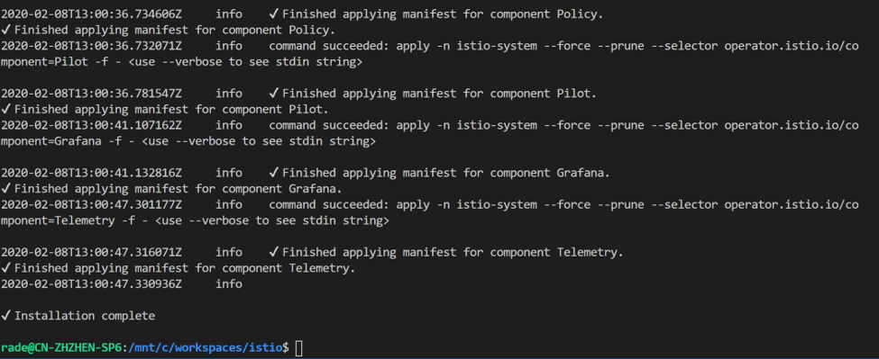

# Istio 1.4.3 on AKS

微服务火了好几年，但因为没有统一标准，涉及的技术范围广泛，更新迭代太快，学习曲线较陡，要完整，系统的掌握并非易事。但技术终究是要为业务服务，不管用什么技术，只要能快速开发，易于部署，简化运维和更新，能快速响应业务的需求和变化，就是好技术。微服务之所以受欢迎，就是一旦掌握了，就可以达到以上目的。就好比开飞机，会开飞机，当然很快，但要学会，得下些功夫。还好，在开源社区和云技术发展得如火如荼的今天，我们不用从零开始造飞机，只要选用主流的技术和平台，学会了就可以稳定飞上好几年。开源当中，Istio无疑是Service Mesh架构微服务最活跃的社区，它基本是技术和平台中立的，支持各种混合部署的模式，解决了微服务中遇到的共性问题，如对连接，安全和监控的管理等等。现在(2020.2.10)稳定的版本也到了1.4.3。这篇文章就先探讨一下 Istio 在Azure上基于AKS的安装，我们可以几分钟内把Istio的平台运行起来，当然，这不是AKS的初级介绍，希望读者对AKS有基本的了解。

我们先简要介绍一下Istio的主要组件，组件架构如下图:<br/>
 <br/>

* __Proxy__ 基于Envoy的side car, 用C++开发的高性能的服务代理，可以自动或手动注入到服务的pod中，实现服务的共性需求，如健康检查，融断，负载均衡，指标采集，加密/安全等。
* __Mixer__ 关键主控组件，主要负责服务策略下发，从Proxy和其他服务收集指标数据等。同时支持通过插件增加功能。
* __Pilot__ 负责服务(Side Car)发现，服务的流量管理/智能路由，以及服务可靠性保障等。
* __Citadel__ 主要负责身份和证书的管理，保障使得服务间以及与客户端间的通信安全。
* __Galley__ 负责配置的验证，导入，处理和分发，它为其他Istio组件屏蔽了底层平台(如Kubernetes)的差异。<br/>
参考: https://istio.io/docs/ops/deployment/architecture/

1. __创建AKS集群__ <br/>
可以参考以下命令，需要注意的是, __Istio安装时默认Pilot Pod需要比较大的内存(2G * 2 pods)，建议不要选4G或以下的虚机。__
```shell
#全局变量 按需要修改
RGName=aksISTIO         #资源组名称
REGION=southeastasia    #部署区域
AKSNAME=aksISTIO        #AKS 集群名称
NODESIZE=Standard_B2ms  #使用虚机大小

#创建资源组
az group create --name $RGName --location $REGION

#创建AKS集群，vm-set-type 和 load-balancer-sku 两参数保证支持多node pool，不需要也可以去掉
az aks create --resource-group $RGName --name $AKSNAME \
    --node-count 2 --enable-addons monitoring --generate-ssh-keys \
    --admin-username myadmin --node-vm-size $NODESIZE \
    --vm-set-type VirtualMachineScaleSets \
    --load-balancer-sku standard


#安装完成后运行以下命令确认运行正常
#安装az aks命令支持
az aks install-cli

#获取AKS集群隐式登录
az aks get-credentials --resource-group $RGName --name $AKSNAME

#查看节点信息
kubectl get nodes

#因为AKS安装Istio需要启用(默认)RBAC, 想用k8s web console，需授权给服务帐号
kubectl create clusterrolebinding kubernetes-dashboard --clusterrole=cluster-admin --serviceaccount=kube-system:kubernetes-dashboard

#通过tunnel本地IP来浏览 k8s web console
az aks browse -n $AKSNAME -g $RGName
```

确认集群创建成功如:
```console
$ kubectl get nodes
NAME                                STATUS   ROLES   AGE   VERSION
aks-nodepool1-36276633-vmss000000   Ready    agent   22h   v1.14.8
aks-nodepool1-36276633-vmss000001   Ready    agent   22h   v1.14.8
```
2. __安装Istio__
    * __先要准备环境__, 在操作的客户端机器上下载，如WSL:
```shell
#下载Istio安装介质
# Specify the Istio version that will be leveraged throughout these instructions
ISTIO_VERSION=1.4.3
curl -sL "https://github.com/istio/istio/releases/download/$ISTIO_VERSION/istio-$ISTIO_VERSION-linux.tar.gz" | tar xz

cd istio-$ISTIO_VERSION
sudo cp ./bin/istioctl /usr/local/bin/istioctl
sudo chmod +x /usr/local/bin/istioctl

# Generate the bash completion file and source it in your current shell
mkdir -p ~/completions && istioctl collateral --bash -o ~/completions
source ~/completions/istioctl.bash

# Source the bash completion file in your .bashrc so that the command-line completions
# are permanently available in your shell
echo "source ~/completions/istioctl.bash" >> ~/.bashrc


#创建istio namespace
kubectl create namespace istio-system --save-config

#管理员密码
MYPASSWORD=xxxxxxxxx

#在k8s创建Grafana的管理用户
GRAFANA_USERNAME=$(echo -n "grafana" | base64)
GRAFANA_PASSPHRASE=$(echo -n ${MYPASSWORD} | base64)

cat <<EOF | kubectl apply -f -
apiVersion: v1
kind: Secret
metadata:
  name: grafana
  namespace: istio-system
  labels:
    app: grafana
type: Opaque
data:
  username: $GRAFANA_USERNAME
  passphrase: $GRAFANA_PASSPHRASE
EOF

#在k8s创建Kiali的管理用户
KIALI_USERNAME=$(echo -n "kiali" | base64)
KIALI_PASSPHRASE=$(echo -n ${MYPASSWORD} | base64)

cat <<EOF | kubectl apply -f -
apiVersion: v1
kind: Secret
metadata:
  name: kiali
  namespace: istio-system
  labels:
    app: kiali
type: Opaque
data:
  username: $KIALI_USERNAME
  passphrase: $KIALI_PASSPHRASE
EOF
```

* __通过yaml来安装istio__ <br/>
    Istio自带安装脚本，里面有几个安装模版，每个模版含不同的组件，见下图:
     <br/>
    如果想安装demo的模版，可以通过下面命令:
```shell
istioctl manifest apply --set profile=demo
```
<br/>
也可以创建istio安装yaml文件，来自定义安装组件，见: [istio.aks.yaml](./istio.aks.yaml) <br/>
安装命令如下，在安装介质目录外面运行:

```shell
istioctl manifest apply -f istio.aks.yaml --logtostderr --set installPackagePath=./istio-1.4.3/install/kubernetes/operator/charts
```
安装完成如下图:


* __确认安装成功__
```shell
#确认安装成功
kubectl get svc --namespace istio-system --output wide

#确认所有Pod都在running状态
kubectl get pods --namespace istio-system

#可以用上面创建的管理用户登录
istioctl dashboard grafana

istioctl dashboard prometheus

istioctl dashboard jaeger

#可以用上面创建的管理用户登录
istioctl dashboard kiali
```

至此，安装完成。几分钟就有一个可用的Istio环境了，接下来可以把精力主要放在如何开发或运维上面。出于学习的目的，大家也可以尝试部署Istio官方例子Bookinfo App, 具体参考: https://istio.io/docs/examples/bookinfo/
 <br/>

例子成功部署如下图:<br/>
 <br/>

希望大家都可以成为中国机长。

