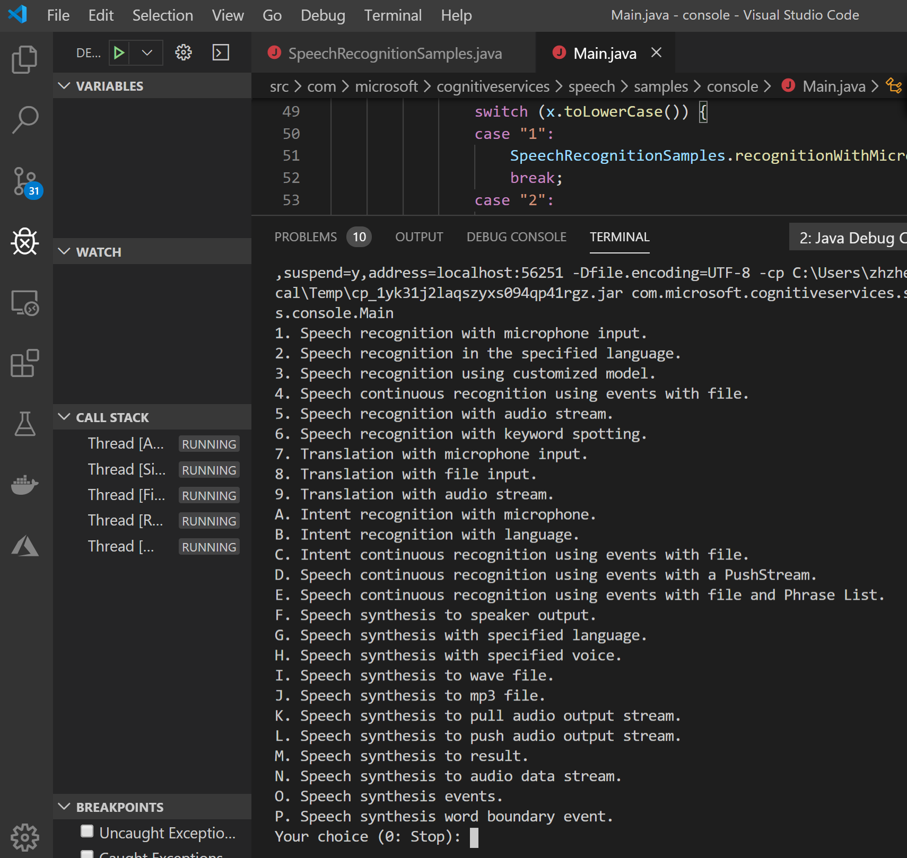
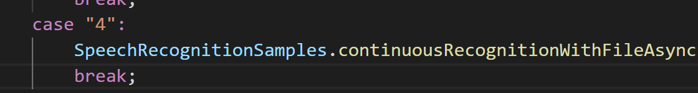
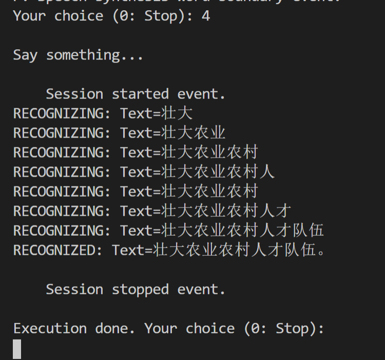
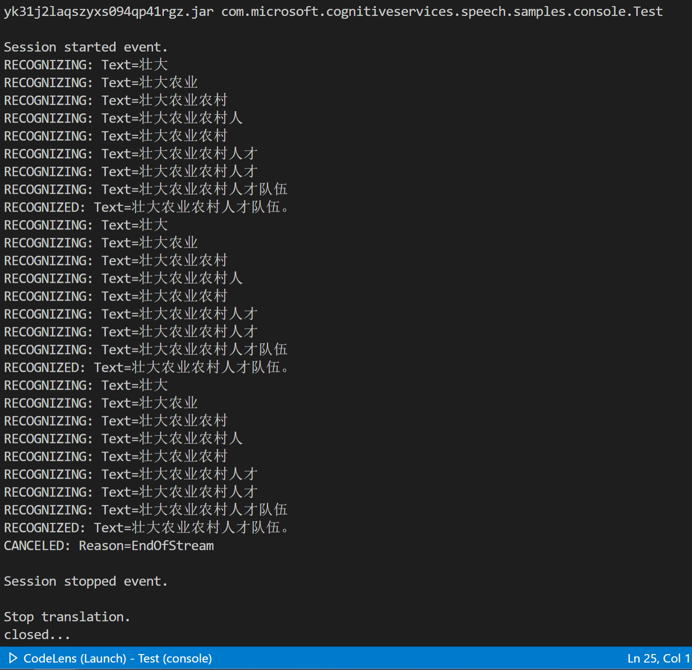

# Speech SDK for Java 中使用 Push Stream

Azure在2018年发布了新版本的语音服务(Speech Service), 可以在单个 Azure 订阅中整合了语音转文本(STT)、文本转语音(TTS)以及语音翻译(Speech Translator)功能, 所支持的语言列表可以参考官方文档: https://docs.microsoft.com/zh-cn/azure/cognitive-services/speech-service/language-support。 使用语音 SDK、语音设备 SDK 或 REST API 可以轻松在应用程序、工具和设备中启用语音，并支持多种开发语言，参考:https://docs.microsoft.com/zh-cn/azure/cognitive-services/speech-service/speech-sdk 。 到9021年11月，Speech SDK也发布到了1.8的版本。今天我们来探讨一下如何用Java来使用Azure Speech SDK.

首先，官方的例子在这里 https://github.com/Azure-Samples/cognitive-services-speech-sdk/tree/master/samples/java/jre/console , 下载到本地后, 可以直接运行:<br/>
运行效果 <br/>

可以看到，这个例子涵盖了使用语音服务的各种场景，包括：
* 语音识别(STT)从麦克风，文件，语音流等等，
* 语音翻译
* 语音合成(TTS)，生成的语音输出到扬声器，文件(wav/mp3)或者各种流等。

例子的入口是Main.java, 然后按不同的场景链接到不同的Java类和方法，以最简单的场景为例，场景4，通过语音文件识别为文字。<br/>


我们就需要修改SpeechRecognitionSamples.continuousRecognitionWithFileAsync()函数，将密钥和区域信息加上，并设定语音文件的语言，和路径，如
```Java
        //这里不是Azure订阅的ID, 是语音服务的key
        SpeechConfig config = SpeechConfig.fromSubscription("xxxx", "eastasia");
        config.setSpeechRecognitionLanguage("zh-CN");
        AudioConfig audioInput = AudioConfig.fromWavFileInput("/workspaces/cognitive/A.wav");
```

如果还没创建语音服务，参考这里: https://docs.microsoft.com/zh-cn/azure/cognitive-services/speech-service/get-started 国内测试的话创建时建议选东亚(eastasia),也就是香港。

运行效果如下:<br/>


到这里基本可以体验识别的效果。我们也可以看到输出有 RECOGNIZING 和 RECOGNIZED，分别代表了识别过程中的中间结果，和识别的完整结果。Speech API在Async的模式下会以事件回调的方式将结果返回，常用的Event在样例代码中都有参考，如:

* recognizing: 识别的中间结果。
* recognized: 识别的阶段性最终结果。会有offset和duration返回，可以知道结果对应于语音的时间位移和时长。
* canceled:  取消，可能是主动取消，或发生错误，具体看ErrorDetals
* sessionStarted: 识别会话的开始，Session ID会在客户端本地生成，发生异常情况时这个便于后台查询分析。所以建议本地日志需要记录。可以通过 e.getSessionId() 获得。
* sessionStopped: 会话结束。

在识别结束后如果再也不需要了，记得调用close()方法释放资源。

但在有些情况下，我们需要识别的语音不是只有一个文件，如果有大量存量的语音文件需要转换成文本，建议使用Batch API, 需要先将语音文件存放到云端可以访问的URL上，如Azure Storage.具体参考 https://docs.microsoft.com/zh-cn/azure/cognitive-services/speech-service/batch-transcription 。

或者，只想识别多个在本地的文件，或者是有自己的语音流需要连续不段的识别，就需要用到推流(Push Stream)的方式，如:
```Java
        ...
        //创建推流的实例 inStream
        PushAudioInputStream inStream = AudioInputStream.createPushStream();
        AudioConfig audioInput = AudioConfig.fromStreamInput(inStream);
        
        try{
        // Creates a speech recognizer using audio stream input.
        SpeechRecognizer recognizer = new SpeechRecognizer(config, audioInput);
        {
            // Subscribes to events.
            ....
            // Starts continuous recognition. Uses stopContinuousRecognitionAsync() to stop recognition.
            recognizer.startContinuousRecognitionAsync().get();

            //在session开始后，只要Stream还没close，就可以在需要的地方写进去。如这里可以循环写入多个本地文件
            for(int i=1;i<4;i++){
                byte[] b =new byte[2048];
                WavStream f = new WavStream(new FileInputStream("/" + i + ".wav"));
                while(f.read(b)>0)
                    inStream.write(b);
                f.close();
            }

            //不需要了，在最后的时候写入EndOfStream
            inStream.write(null);

            // Waits for completion.
            stopRecognitionSemaphore.acquire();

            // Stops recognition.
            recognizer.stopContinuousRecognitionAsync().get();
        }

        //关闭推流
        inStream.close();
        config.close();
        audioInput.close();
        recognizer.close();
       
        System.out.println("closed...");
        System.exit(0);
        ...
```
比如我用同一个文件识别多次，运行效果如下:


可见Azure Speech SDK越来越完善，提供非常多样的使用方式，欢迎大家尝试使用。


